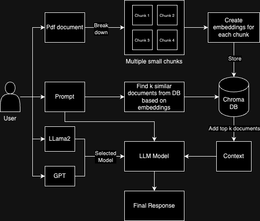

# Databot

This project enables users to obtain answers to their questions from a document. Users must upload a PDF file and select a model. Subsequently, they can ask questions related to the content of the PDF and receive answers.

For deploying Olama on k8s : https://sarinsuriyakoon.medium.com/deploy-ollama-on-local-kubernetes-microk8s-6ca22bfb7fa3

## Design

## Frontend

